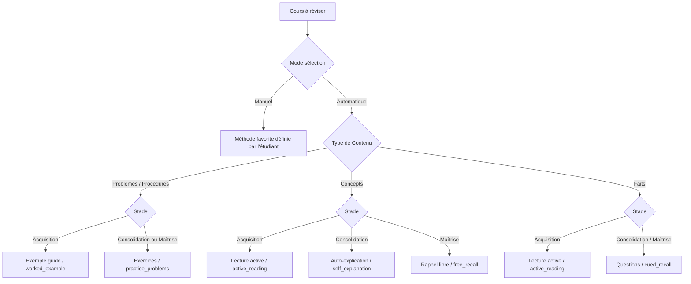

# Méthodes d'Apprentissage & Moteur Pédagogique

Ce document présente les 7 méthodes d'apprentissage intégrées dans MémoCycle, le moteur de recommandation adaptatif et les principes d'indépendance avec le modèle FSRS.

---

## 1. Les 7 Méthodes d'Apprentissage

| Identifiant Technique | Libellé Utilisateur | Type d'Engagement | Description Pédagogique |
| :--- | :--- | :--- | :--- |
| `passive_reading` | **Lecture** | Passif | Lecture linéaire du support de cours. Utilisée principalement pour une première prise de contact. |
| `active_reading` | **Lecture active** | Actif | Lecture avec surlignage stratégique, annotation marginale et identification des concepts clés. |
| `self_explanation` | **Auto-explication** | Génératif | Formulation avec ses propres mots des liens causaux et des mécanismes sous-jacents (Technique Feynman). |
| `free_recall` | **Rappel libre** | Récupération | Restitution à partir d'une feuille blanche de tout ce dont l'étudiant se souvient sur le sujet sans indice. |
| `cued_recall` | **Questions** | Récupération indicée | Réponse à des questions flashcards, quiz ou prompts ciblés. |
| `practice_problems` | **Exercices** | Application | Résolution d'exercices pratiques, de cas cliniques, d'annales ou de problèmes mathématiques. |
| `worked_example` | **Exemple guidé** | Modélisation | Analyse pas à pas d'un problème résolu pour comprendre la démarche méthodologique avant de s'exercer. |

---

## 2. Profilage des Cours & Paramètres Pédagogiques

Chaque cours dispose de métadonnées facultatives permettant d'adapter l'apprentissage :

### A. Type de Contenu (`contentType`)
- `facts` (**Faits**) : Vocabulaire, définitions, dates, nomenclature anatomique.
- `concepts` (**Concepts**) : Théories, mécanismes physiologiques, principes juridiques.
- `procedures` (**Procédures**) : Algorithmes, démarches diagnostiques, protocoles.
- `problem_solving` (**Problèmes**) : Démonstrations, calculs, études de cas.
- `mixed` (**Mixte**) : Cours combinant faits, concepts et applications.

### B. Connaissances Initiales (`priorKnowledge`)
- `none` (**Nouveau**) : Première découverte du domaine.
- `basic` (**Quelques bases**) : Notions vagues ou souvenirs de cours antérieurs.
- `familiar` (**Familier**) : Bonne compréhension générale.
- `strong` (**Solide**) : Maîtrise préalable avancée.

### C. Mode de Sélection (`methodSelectionMode`)
- `automatic` (**Recommandation automatique**) : MémoCycle recommande la méthode optimale selon la phase d'apprentissage et le profil du cours.
- `manual` (**Choix manuel**) : L'étudiant sélectionne une méthode favorite par défaut (`preferredStudyMethod`).

---

## 3. Stades d'Apprentissage Observés (`learningStage`)

Le stade d'apprentissage est déduit des métriques de rétention et de stabilité FSRS :

1. `acquisition` (**Acquisition**) : Découverte du cours (0 répétition ou reprise après oubli `again`).
2. `consolidation` (**Consolidation**) : Stabilisation des premières connexions (1 à 2 répétitions réussies, stabilité < 7 jours).
3. `retrieval` (**Entraînement au rappel**) : Pratique active de la récupération espacée (stabilité intermédiaire).
4. `mastery` (**Maîtrise**) : Ancrage profond à long terme (stabilité >= 30 jours ou step >= 5).

---

## 4. Matrice de Recommandation Adaptative

---

## 5. Règle d'Invariance FSRS

- **Aucune influence arbitraire sur FSRS** : Le choix d'une méthode d'apprentissage n'altère en aucun cas les formules mathématiques de l'intervalle FSRS.
- **La performance réelle seule compte** : Seule la note de rétention attribuée par l'étudiant (`again`, `hard`, `good`, `easy`) met à jour la stabilité et la difficulté.
- **Révisions volontaires (`voluntary_review`)** : L'étudiant peut réviser un cours à tout moment via "Réviser maintenant" sans casser l'échéancier existant.
